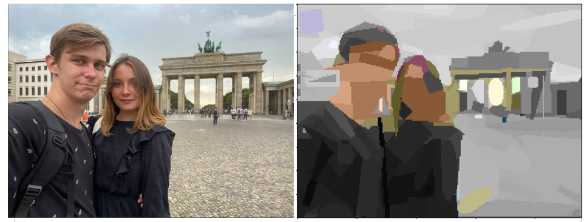
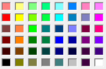
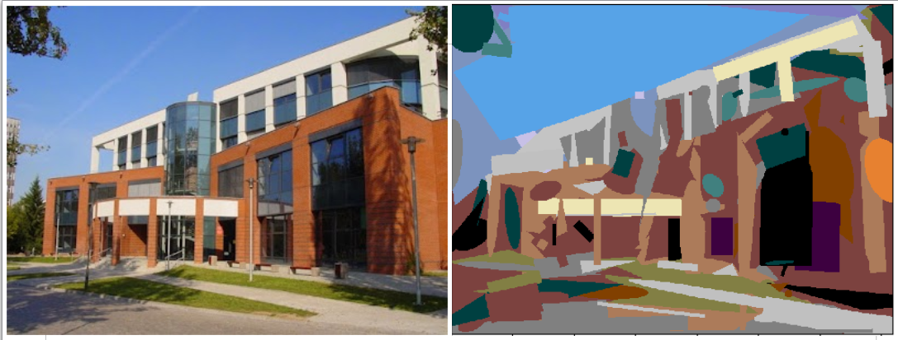

Python + CUDA "paint-looks-alike generative art" evolution algorithm
======

This is a Python + CUDA solution, that recreates given image in Paint-looks-alike style using the evolutionary algorithm approach
### Example of work:

_(here on pic: authors of the current script, extended color space)_

143 figures,  
time from the start to the end in this example: approx. 8 hours

The author of the original idea is [Roger Alsing](https://rogerjohansson.blog/2008/12/07/genetic-programming-evolution-of-mona-lisa/)

## How to run the script

run the main.py

**Important:** the size of the initial picture (height x width) should be multiple be 20, e.g. 180x240 
(this limitation goes from the current cuda realization)

I strongly advise not using big pictures, the optimal size is around 200x200

This is theoretically possible to run this script without CUDA (the environment variable **NUMBA_ENABLE_CUDASIM** should be set to 1)
however, the time of execution will increase significantly

## Main realization details

There are 3 + 1 figures available (Rectangle, Ellipse, Triangle, and Line as a particular case of Rectangle). 
Rectangle and Ellipse can be rotated (the axis of rotation is the center of a figure)

Opacity is not supported as the main idea of the script was to generate the "paint-like" images 

The possible mutations of one figure: slightly change the position of the figure, angle of rotation (if possible) 
and color of the figure (substitute with some similar color). Additionally, it is possible to convert one figure to another:
  - Rectangle ↔ Triangle
  - Rectangle ↔ Ellipse
  - Ellipse → Triangle
  
The mutations in the scope of the whole picture include adding new figures, removing figures and shuffling the order of figures.

The examples of mutation can be found in `tests/figure_test.py`

The evolution itself includes mutation and simple crossovers of the best part of the population. 
Evolution is sequential, e.g. we are trying to achieve as good as possible result with `n` figures and then allow to explore `n + delta` figures

The goal function is not the simple sum of pixel differences but more complex [readmean](https://en.wikipedia.org/wiki/Color_difference#sRGB) distance, 
this distance is a more appropriate measurement from the point of the human perception of color

The possible color pallet is limited on purpose with around 60 "standard" paint colors

It is possible to add "hue" and expand the color space from 60 to around 2800 colors, just set the 
variable **IS_EXTENDED_COLOR_SPACE** in `Color.py` to True

### Acknowledgment

This project was done by Holovashchenko Vadym and Anna Nosach for the Evolutionary Algorithm course, University of Wrocław, 2021

_(a campus of the Institute of Computer Science, University of Wrocław)_